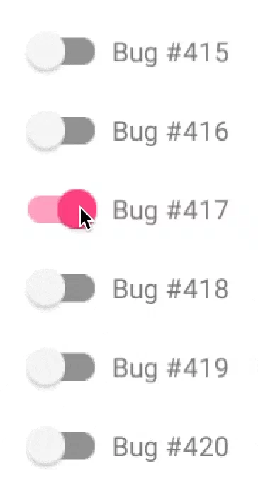

## Hello, friends! ✌

I'm Gabriel Rodrigues, a Brazilian passionate front-end developer who loves to create new things and explore new technologies. Curious and lover of challenges that requires my creativity, logic and knowledge to find the best solution.

## 💻 Technologies

- **UI/UX** best practices and uses
- Front-end development using **React.js or Vue.js**
- Server-side rendering with **Next.js**
- State management libraries like **Redux or Vuex**
- Backend development using **Node.js**
- Loving the **JavaScript**

\

\

